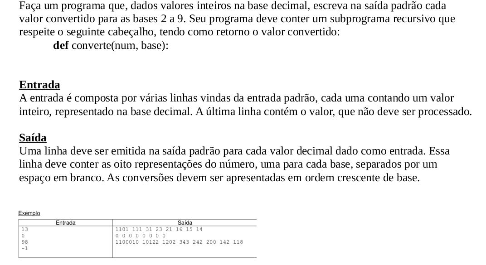
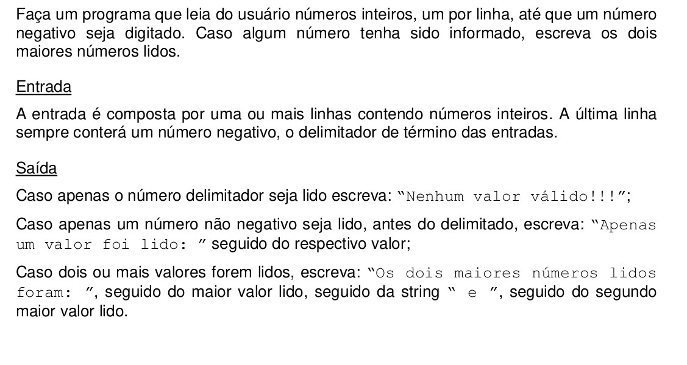
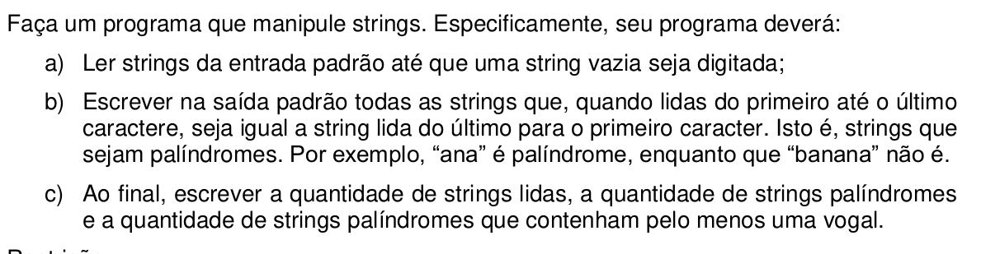
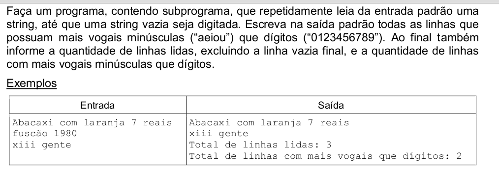
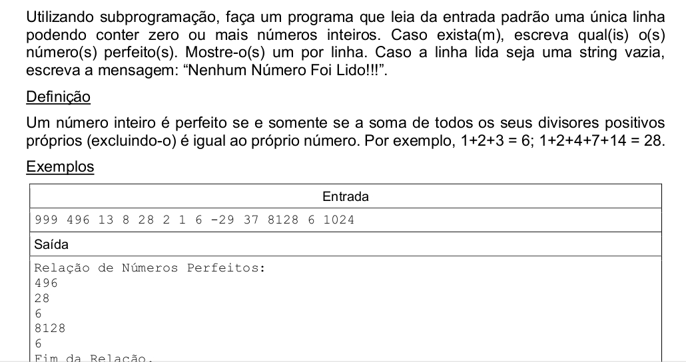
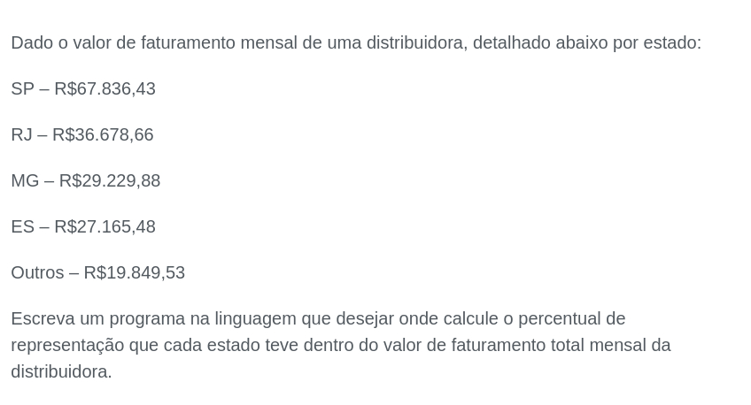
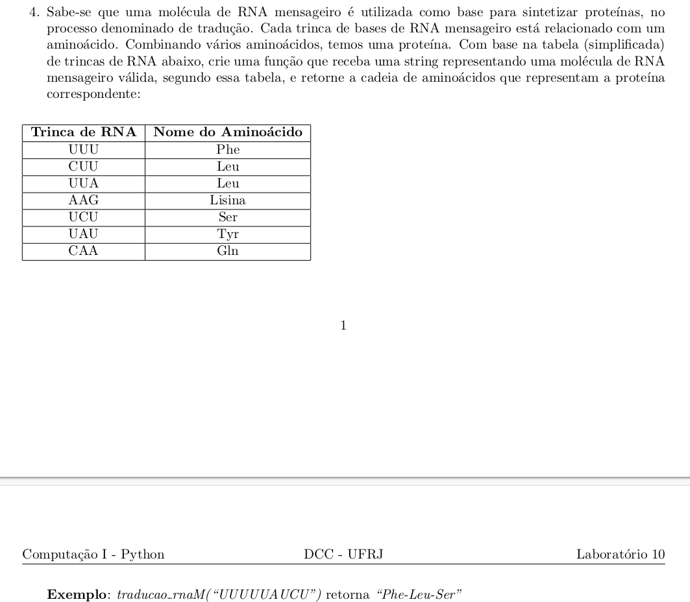

# Introdução

Esta pasta contém material que pode ser usado por programadores ou não programadores que desejam iniciar, treinar ou melhorar seu conhecimento.

### Dia 1: Transforme um número com base decimal em bases de 2 a 9 

### Dia 2: Ache os dois maiores números que estão sendo passados pelo usuário

### Dia 3: Identifique palavras palindromes que contenham vogais

### Dia 4: Identificar a frase que contem mais vogais que dígitos

### Dia 5: Em apenas uma linha, digite os números e ache quais são perfeitos

### Dia 6: Fazer o faturamento mensal total e faturamento de cada cidade em relação ao total

### Dia 7: Descubra qual a cadeia de aminoácidos que representa tal proteína

#### Os assuntos abordados são estes:

- [x] if/elif/else
- [x] for/while
- [x] fatiamento de strings
- [x] lista, tupla, dicionário, set, função
- [x] operadores aritméticos e lógicos
